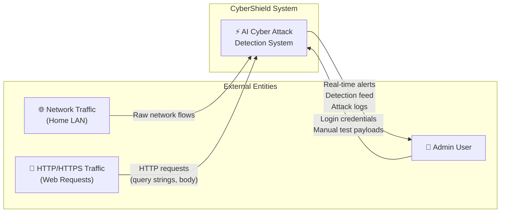
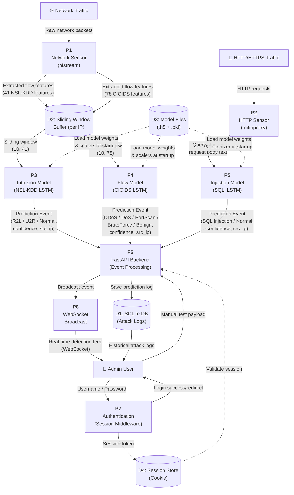
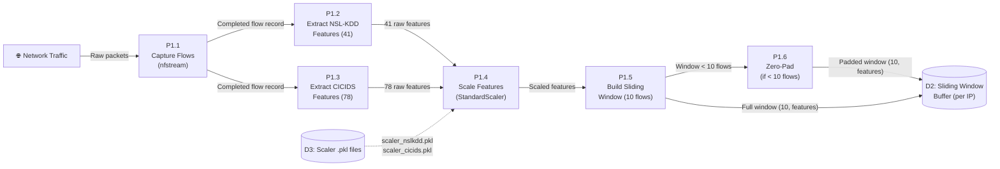
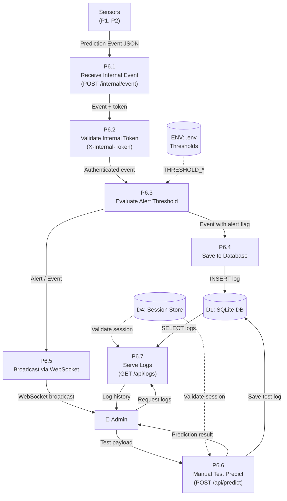
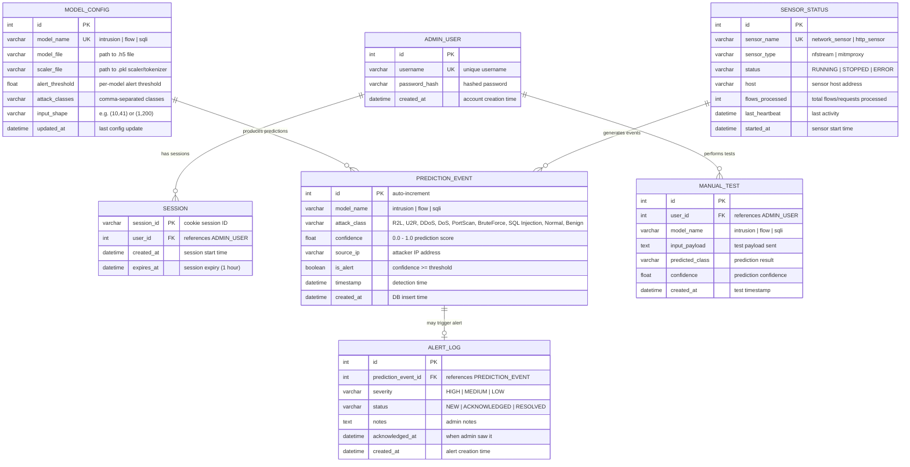

# CyberShield — DFD & ER Diagrams

---

## 1. Data Flow Diagram (DFD)

### 1.1 Context Diagram (DFD Level 0)

แสดงภาพรวมของระบบ CyberShield กับ External Entities ทั้งหมด

---

### 1.2 DFD Level 1

แสดง Process หลักภายในระบบ, Data Stores, และการไหลของข้อมูล

---

### 1.3 DFD Level 2 — Process P1: Network Sensor (Detail)

---

### 1.4 DFD Level 2 — Process P6: FastAPI Backend (Detail)

---

## 2. Entity-Relationship Diagram (ER Diagram)

### 2.1 ER Diagram — ฐานข้อมูล CyberShield

---

### 2.2 ตารางสรุป Entities

| Entity | คำอธิบาย | Key Attributes |
|---|---|---|
| **ADMIN_USER** | ผู้ดูแลระบบ (single admin user, credentials from `.env`) | `username`, `password_hash` |
| **SESSION** | Session-based authentication (Starlette SessionMiddleware) | `session_id`, `expires_at` (1 hr) |
| **PREDICTION_EVENT** | ผลการ detect จาก 3 LSTM models ทุกครั้งที่มี flow/request เข้ามา | `model_name`, `attack_class`, `confidence`, `source_ip`, `is_alert` |
| **MODEL_CONFIG** | การตั้งค่าของแต่ละ model (threshold, file paths, input shape) | `model_name`, `alert_threshold`, `model_file` |
| **ALERT_LOG** | Alert ที่ confidence ≥ threshold พร้อม status tracking | `severity`, `status`, `notes` |
| **SENSOR_STATUS** | สถานะของ Network Sensor และ HTTP Sensor | `sensor_name`, `status`, `last_heartbeat` |
| **MANUAL_TEST** | ประวัติการทดสอบจากหน้า `/test` (bypass sensor) | `input_payload`, `predicted_class` |

---

### 2.3 Relationships สรุป

| Relationship | Cardinality | คำอธิบาย |
|---|---|---|
| ADMIN_USER → SESSION | 1 : N | Admin 1 คน มีได้หลาย sessions (ล็อกอินหลายครั้ง) |
| ADMIN_USER → MANUAL_TEST | 1 : N | Admin ทดสอบ payload ได้หลายครั้ง |
| PREDICTION_EVENT → ALERT_LOG | 1 : 0..1 | Prediction Event อาจกลายเป็น Alert (ถ้า ≥ threshold) |
| MODEL_CONFIG → PREDICTION_EVENT | 1 : N | แต่ละ model สร้าง prediction events หลายรายการ |
| SENSOR_STATUS → PREDICTION_EVENT | 1 : N | แต่ละ sensor ส่ง events เข้าระบบหลายรายการ |

---

### 2.4 Data Dictionary — PREDICTION_EVENT (ตารางหลัก)

| Column | Type | Constraints | Description |
|---|---|---|---|
| `id` | INTEGER | PK, AUTO INCREMENT | Primary key |
| `model_name` | VARCHAR(20) | NOT NULL | `'intrusion'` / `'flow'` / `'sqli'` |
| `attack_class` | VARCHAR(30) | NOT NULL | ชื่อ class ที่ model predict ได้ |
| `confidence` | FLOAT | NOT NULL, CHECK(0≤x≤1) | ค่าความมั่นใจ 0.0–1.0 |
| `source_ip` | VARCHAR(45) | NOT NULL | IP ต้นทาง (รองรับ IPv6) |
| `is_alert` | BOOLEAN | NOT NULL, DEFAULT FALSE | `TRUE` ถ้า confidence ≥ threshold |
| `timestamp` | DATETIME | NOT NULL | เวลาที่ detect ได้จริง |
| `created_at` | DATETIME | DEFAULT CURRENT_TIMESTAMP | เวลาที่ INSERT เข้า DB |

> [!NOTE]
> Schema ถูกออกแบบให้ไม่ใช้ SQLite-specific types เพื่อรองรับการย้ายไป PostgreSQL ในอนาคตตามที่ระบุใน CONTEXT.md
