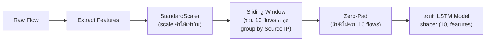
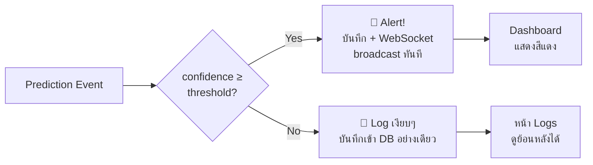

# CyberShield — สรุปการทำงานของโปรเจกต์

> **AI Cyber Attack Detection System** — ระบบตรวจจับการโจมตีทางไซเบอร์แบบ real-time โดยใช้ 3 LSTM Models

---

## 🎯 เป้าหมายของโปรเจกต์

ตรวจจับการโจมตีทางไซเบอร์ **แบบ real-time** จาก network traffic ภายใน Home LAN โดยใช้ AI (LSTM Deep Learning) แล้วแสดงผลผ่าน Dashboard ทันที

---

## 🏗️ สถาปัตยกรรมภาพรวม

```
┌─────────────────┐     ┌─────────────────┐
│  Network Traffic │     │  HTTP/HTTPS     │
│  (Home LAN)      │     │  Traffic        │
└────────┬────────┘     └────────┬────────┘
         │                       │
         ▼                       ▼
┌─────────────────┐     ┌─────────────────┐
│  Network Sensor  │     │  HTTP Sensor    │
│  (nfstream)      │     │  (mitmproxy)   │
└────────┬────────┘     └────────┬────────┘
         │                       │
         ▼                       ▼
┌──────────────────────────────────────────┐
│           FastAPI Backend (:8000)         │
│  ┌──────────┐ ┌──────────┐ ┌──────────┐ │
│  │ Intrusion│ │  Flow    │ │ Injection│ │
│  │  Model   │ │  Model   │ │  Model   │ │
│  │(UNSW-NB15) │ │(CSE-CIC-IDS2018)  │ │  (SQLi)  │ │
│  └──────────┘ └──────────┘ └──────────┘ │
│                                          │
│  ┌──────────┐ ┌──────────┐              │
│  │ SQLite DB│ │WebSocket │              │
│  │(WAL mode)│ │Broadcast │              │
│  └──────────┘ └──────────┘              │
└──────────────────┬───────────────────────┘
                   │
                   ▼
┌──────────────────────────────────────────┐
│        React Dashboard (nginx :80)       │
│  ┌──────────┐ ┌──────┐ ┌──────────────┐ │
│  │Dashboard │ │ Logs │ │ Manual Test  │ │
│  │(Live)    │ │      │ │ (/test)      │ │
│  └──────────┘ └──────┘ └──────────────┘ │
└──────────────────────────────────────────┘
```

---

## 📡 ขั้นตอนการทำงาน (Pipeline) ทีละ Step

### Step 1 — Sensors จับ Traffic

| Sensor | เครื่องมือ | จับอะไร | ส่งต่อให้ Model ไหน |
|---|---|---|---|
| **Network Sensor** | `nfstream` | Network flows (byte counts, duration, flags ฯลฯ) | Intrusion Model + Flow Model |
| **HTTP Sensor** | `mitmproxy` | HTTP requests (query strings, request body) | Injection Model |

### Step 2 — เตรียมข้อมูลก่อนเข้า Model



> [!IMPORTANT]
> **Sliding Window** จะ group by Source IP — เพื่อให้ model เห็น pattern ของ **แต่ละ IP** แยกกัน เช่น IP หนึ่ง scan port ต่อเนื่อง 10 ครั้ง

### Step 3 — 3 LSTM Models ทำ Prediction

````carousel
### 🔴 Model 1: Intrusion Model (UNSW-NB15)

| รายละเอียด | ค่า |
|---|---|
| **Dataset** | UNSW-NB15 (~25 MB) |
| **Input shape** | `(10, 49)` — 10 flows × 49 features |
| **Output** | 3 classes: **Normal, R2L, U2R** |
| **Scaler** | `scaler_unswnb15.pkl` |
| **ไฟล์ model** | `lstm_unswnb15.h5` |

**ตรวจจับ:**
- **R2L** (Remote-to-Local) — พยายามเข้าถึงระบบจากระยะไกลโดยไม่ได้รับอนุญาต
- **U2R** (User-to-Root) — ยกระดับสิทธิ์จาก user ธรรมดาเป็น root
<!-- slide -->
### 🟠 Model 2: Flow Model (CSE-CIC-IDS2018)

| รายละเอียด | ค่า |
|---|---|
| **Dataset** | CSE-CIC-IDS2018 Friday-Afternoon (~600 MB) |
| **Input shape** | `(10, 78)` — 10 flows × 78 features |
| **Output** | 5 classes: **Benign, DoS, DDoS, PortScan, BruteForce** |
| **Scaler** | `scaler_csecicids2018.pkl` |
| **ไฟล์ model** | `lstm_csecicids2018.h5` |

**ตรวจจับ:**
- **DDoS** — โจมตีแบบกระจายเพื่อทำให้ระบบล่ม
- **DoS** — โจมตีแบบ denial of service
- **PortScan** — สแกนหาช่องโหว่ตาม port
- **BruteForce** — เดารหัสผ่านซ้ำๆ
<!-- slide -->
### 🟡 Model 3: Injection Model (SQLi)

| รายละเอียด | ค่า |
|---|---|
| **Dataset** | SecLists SQLi Dataset |
| **Input** | Raw text (query string + body) → Embedding |
| **Output** | Binary: **Normal / SQL Injection** |
| **Tokenizer** | `tokenizer_sqli.pkl` (ไม่ใช้ Scaler) |
| **ไฟล์ model** | `lstm_sqli.h5` |

**ตรวจจับ:**
- **SQL Injection** — ฝัง SQL ลงใน HTTP request เช่น `' OR 1=1 --`
````

### Step 4 — สร้าง Prediction Event

เมื่อ model ทำนายเสร็จ จะสร้าง **Prediction Event** ส่งเข้า FastAPI:

```json
{
  "model_name": "flow",
  "attack_class": "DDoS",
  "confidence": 0.92,
  "source_ip": "192.168.1.105",
  "timestamp": "2026-07-09T13:00:00"
}
```

### Step 5 — ตรวจสอบ Alert Threshold

| Model | Threshold | ถ้า confidence ≥ threshold |
|---|---|---|
| Intrusion Model | `0.85` | 🔴 แสดงเป็น **Alert** (สีแดง) |
| Flow Model | `0.80` | 🔴 แสดงเป็น **Alert** (สีแดง) |
| Injection Model | `0.75` | 🔴 แสดงเป็น **Alert** (สีแดง) |

ถ้า confidence **ต่ำกว่า** threshold → บันทึก log เงียบๆ ไม่แจ้งเตือน

### Step 6 — บันทึก + แจ้งเตือน



---

## 🖥️ หน้าเว็บ (Frontend)

| หน้า | เส้นทาง | ต้อง Login? | ทำอะไร |
|---|---|---|---|
| **Login** | `/login` | ❌ | กรอก username/password เข้าสู่ระบบ |
| **Dashboard** | `/dashboard` | ✅ | แสดง attack feed แบบ real-time ผ่าน WebSocket |
| **Logs** | `/logs` | ✅ | ดูประวัติ prediction ทั้งหมดจาก DB |
| **Manual Test** | `/test` | ✅ | ส่ง payload ทดสอบ model โดยตรง (ไม่ผ่าน sensor) |
| **Logout** | `/logout` | ✅ | ล้าง session + redirect กลับ login |

---

## 🔐 ระบบ Authentication

- ใช้ **Session-based** (Starlette SessionMiddleware) — เก็บ session ใน cookie
- Session หมดอายุใน **1 ชั่วโมง**
- มี admin **คนเดียว** — credentials อยู่ใน `.env`
- Internal endpoint (`/internal/event`) ป้องกันด้วย **X-Internal-Token** header

---

## 🔧 Tech Stack ทั้งหมด

| Layer | เทคโนโลยี |
|---|---|
| **Backend** | FastAPI + Uvicorn |
| **AI Models** | TensorFlow/Keras LSTM × 3 |
| **Database** | SQLite (WAL mode) — ออกแบบให้ migrate เป็น PostgreSQL ได้ |
| **Real-time** | WebSocket `/ws/feed` (server → client broadcast) |
| **Auth** | Starlette SessionMiddleware (cookie-based, 1 hr) |
| **Frontend** | React SPA → build เป็น `dist/` |
| **Web Server** | nginx (serve static + proxy API + WebSocket) |
| **Network Sensor** | nfstream (Python) |
| **HTTP Sensor** | mitmproxy (transparent proxy) |
| **Training** | Kaggle Notebooks (Free GPU: Tesla T4/P100) |
| **Feature Scaling** | scikit-learn StandardScaler (`.pkl`) |

---

## 🚀 ลำดับการเปิดระบบ

```
1. uvicorn backend.main:app --port 8000     ← FastAPI + โหลด 3 models
2. sudo python network_sensor.py            ← จับ network traffic (ต้อง root)
3. sudo mitmproxy --scripts http_sensor.py  ← จับ HTTP traffic (ต้อง root)
4. sudo systemctl start nginx               ← serve frontend + proxy
```

---

## 📊 สรุปเป็นภาพ: จากข้อมูลดิบ → ถึงหน้าจอ

```
🌐 Network Traffic          🔗 HTTP Request
       │                          │
       ▼                          ▼
  nfstream จับ flow         mitmproxy จับ request
       │                          │
       ▼                          ▼
  extract features          extract query text
       │                          │
       ▼                          ▼
  StandardScaler            Tokenizer + Padding
       │                          │
       ▼                          ▼
  Sliding Window (10 flows)       │
       │                          │
       ├──► Intrusion Model       │
       │    (R2L / U2R)           │
       │                          │
       ├──► Flow Model            │
       │    (DDoS/DoS/PortScan)   │
       │                          │
       │                    Injection Model ◄──┘
       │                    (SQLi)
       │                          │
       ▼                          ▼
  ┌──────────────────────────────────┐
  │    POST /internal/event          │
  │    (ส่ง Prediction Event)        │
  └──────────────┬───────────────────┘
                 │
                 ▼
  ┌──────────────────────────────────┐
  │  FastAPI: check threshold        │
  │  → บันทึก SQLite                 │
  │  → broadcast WebSocket           │
  └──────────────┬───────────────────┘
                 │
                 ▼
  ┌──────────────────────────────────┐
  │  👤 Admin Dashboard              │
  │  เห็น alert แบบ real-time        │
  └──────────────────────────────────┘
```
